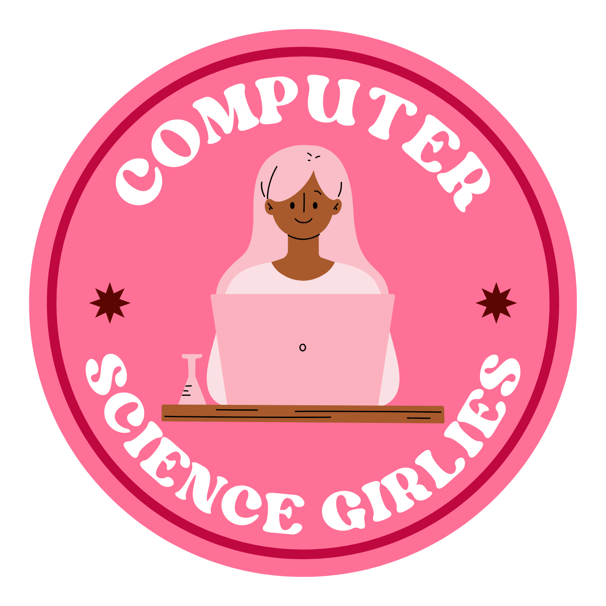

# 💝 Computer Science Girlies Website

<a id="readme-top"></a>

[![Contributors][contributors-shield]][contributors-url]
[![Forks][forks-shield]][forks-url]
[![Stargazers][stars-shield]][stars-url]
[![Issues][issues-shield]][issues-url]
[![MIT License][license-shield]][license-url]
[![Discord][discord-shield]][discord-url]
<!-- PROJECT LOGO -->
<br />
<div align="center">
  <a href="https://github.com/Computer-Science-Girlies/cs-girlies-com">
    
  </a>

  <h3 align="center">✨ Computer Science Girlies ✨</h3>

  <p align="center">
    A vibrant community platform empowering women and non-binary individuals in computer science! 👩‍💻✨
    <br />
    <a href="https://github.com/Computer-Science-Girlies/cs-girlies-com"><strong>Explore the docs »</strong></a>
    <br />
    <br />
    <a href="https://csgirlies.com">View Live Site</a>
    ·
    <a href="https://github.com/Computer-Science-Girlies/cs-girlies-com/issues/new?labels=bug&template=bug-report---.md">Report Bug</a>
    ·
    <a href="https://github.com/Computer-Science-Girlies/cs-girlies-com/issues/new?labels=enhancement&template=feature-request---.md">Request Feature</a>
  </p>
</div>

<!-- TABLE OF CONTENTS -->
<details>
  <summary>Table of Contents</summary>
  <ol>
    <li>
      <a href="#about-the-project">About The Project</a>
      <ul>
        <li><a href="#built-with">Built With</a></li>
      </ul>
    </li>
    <li>
      <a href="#getting-started">Getting Started</a>
      <ul>
        <li><a href="#prerequisites">Prerequisites</a></li>
        <li><a href="#installation">Installation</a></li>
      </ul>
    </li>
    <li><a href="#features">Features</a></li>
    <li><a href="#roadmap">Roadmap</a></li>
    <li><a href="#contributing">Contributing</a></li>
    <li><a href="#license">License</a></li>
    <li><a href="#contact">Contact</a></li>
    <li><a href="#acknowledgments">Acknowledgments</a></li>
  </ol>
</details>

## About The Project

Computer Science Girlies is a community platform dedicated to empowering women and non-binary individuals in the field of computer science. Our website serves as a central hub for resources, inspiration, and connection within our vibrant community! 🌟

### Key Features:
- 📚 Curated learning resources
- 🎯 Hackathon guides and tips
- 💪 Success stories and testimonials
- 🤝 Community engagement opportunities
- 💝 Support network for tech enthusiasts

### Built With

* [![React][React.js]][React-url]
* [![Vite][Vite.js]][Vite-url]
* [![TypeScript][TypeScript]][TypeScript-url]
* [![Tailwind][Tailwind.css]][Tailwind-url]
* [![shadcn/ui][shadcn]][shadcn-url]

<p align="right">(<a href="#readme-top">back to top</a>)</p>

## Getting Started

Follow these simple steps to get a local copy up and running! 🚀

### Prerequisites

* Node.js (v18 or higher)
* bun package manager
```sh
npm install -g bun
```

### Installation

1. Clone the repo
   ```sh
   git clone https://github.com/Computer-Science-Girlies/cs-girlies-com.git
   ```
2. Install packages
   ```sh
   bun install
   ```
3. Start the development server
   ```sh
   bun dev
   ```
4. Change git remote url to avoid accidental pushes to base project
   ```sh
   git remote set-url origin git@github.com:yourusername/cs-girlies-com.git
   git remote -v # confirm the changes
   ```

<p align="right">(<a href="#readme-top">back to top</a>)</p>

## Features

🌟 **Community Hub**
- Share success stories and experiences
- Connect with other tech enthusiasts
- Access curated learning resources

🎯 **Hackathon Resources**
- Comprehensive guides for beginners
- Tips and tricks for success
- Project inspiration and ideas

💪 **Support Network**
- Inspiring testimonials
- Success stories
- Mentorship opportunities

<p align="right">(<a href="#readme-top">back to top</a>)</p>

## Roadmap

Check out our [Project Roadmap](https://github.com/orgs/Computer-Science-Girlies/projects/1/views/3) to see:
- 🎉 Recently completed features
- 🚀 What we're currently working on
- ✨ Upcoming features and enhancements
- 💡 Planned improvements

Have a suggestion? Feel free to open an [issue](https://github.com/Computer-Science-Girlies/cs-girlies-com/issues) or discuss it in our [Discord](https://discord.gg/uqMwZvXHBE)!

<p align="right">(<a href="#readme-top">back to top</a>)</p>

## Contributing

Contributions make the open source community such an amazing place to learn, inspire, and create! Any contributions you make are **greatly appreciated**. 💕

If you have suggestions to make this better, please fork the repo and create a pull request or open an issue with the tag "enhancement"!

1. Fork the Project
2. Create your Feature Branch (`git checkout -b feature/AmazingFeature`)
3. Commit your Changes (`git commit -m 'Add some AmazingFeature'`)
4. Push to the Branch (`git push origin feature/AmazingFeature`)
5. Open a Pull Request

<p align="right">(<a href="#readme-top">back to top</a>)</p>

## License

Distributed under the MIT License. See `LICENSE` for more information.

<p align="right">(<a href="#readme-top">back to top</a>)</p>

## Contact & Support

- 🌐 Website: [csgirlies.com](https://csgirlies.com)
- 💬 Discord: [Join our community](https://discord.gg/uqMwZvXHBE)
- 🐦 Twitter: [@csgirlies](https://twitter.com/csgirlies)
- 📸 Instagram: [@csgirlies](https://instagram.com/csgirlies)
- 💝 Support us: [Donate](https://www.csgirlies.com/donate)
- 📧 Email: [team@csgirlies.com](mailto:team@csgirlies.com)

Project Link: [https://github.com/Computer-Science-Girlies/cs-girlies-com](https://github.com/Computer-Science-Girlies/cs-girlies-com)

<p align="right">(<a href="#readme-top">back to top</a>)</p>

## Acknowledgments

* All our amazing contributors! 💖
* The wonderful women in tech who inspire us daily
* Our supportive community members

<p align="right">(<a href="#readme-top">back to top</a>)</p>

<!-- MARKDOWN LINKS & IMAGES -->
[contributors-shield]: https://img.shields.io/github/contributors/Computer-Science-Girlies/cs-girlies-com.svg?style=for-the-badge
[contributors-url]: https://github.com/Computer-Science-Girlies/cs-girlies-com/graphs/contributors
[forks-shield]: https://img.shields.io/github/forks/Computer-Science-Girlies/cs-girlies-com.svg?style=for-the-badge
[forks-url]: https://github.com/Computer-Science-Girlies/cs-girlies-com/network/members
[stars-shield]: https://img.shields.io/github/stars/Computer-Science-Girlies/cs-girlies-com.svg?style=for-the-badge
[stars-url]: https://github.com/Computer-Science-Girlies/cs-girlies-com/stargazers
[issues-shield]: https://img.shields.io/github/issues/Computer-Science-Girlies/cs-girlies-com.svg?style=for-the-badge
[issues-url]: https://github.com/Computer-Science-Girlies/cs-girlies-com/issues
[license-shield]: https://img.shields.io/github/license/Computer-Science-Girlies/cs-girlies-com.svg?style=for-the-badge
[license-url]: https://github.com/Computer-Science-Girlies/cs-girlies-com/blob/main/LICENSE
[discord-shield]: https://img.shields.io/badge/Join_us_on_Discord-7289DA?style=for-the-badge&logo=discord&logoColor=white
[discord-url]: https://discord.gg/uqMwZvXHBE

[React.js]: https://img.shields.io/badge/React-20232A?style=for-the-badge&logo=react&logoColor=61DAFB
[React-url]: https://reactjs.org/
[Vite.js]: https://img.shields.io/badge/Vite-646CFF?style=for-the-badge&logo=vite&logoColor=white
[Vite-url]: https://vitejs.dev/
[TypeScript]: https://img.shields.io/badge/TypeScript-007ACC?style=for-the-badge&logo=typescript&logoColor=white
[TypeScript-url]: https://www.typescriptlang.org/
[Tailwind.css]: https://img.shields.io/badge/Tailwind-38B2AC?style=for-the-badge&logo=tailwind-css&logoColor=white
[Tailwind-url]: https://tailwindcss.com/
[shadcn]: https://img.shields.io/badge/shadcn%2Fui-000000?style=for-the-badge&logo=shadcnui&logoColor=white
[shadcn-url]: https://ui.shadcn.com/