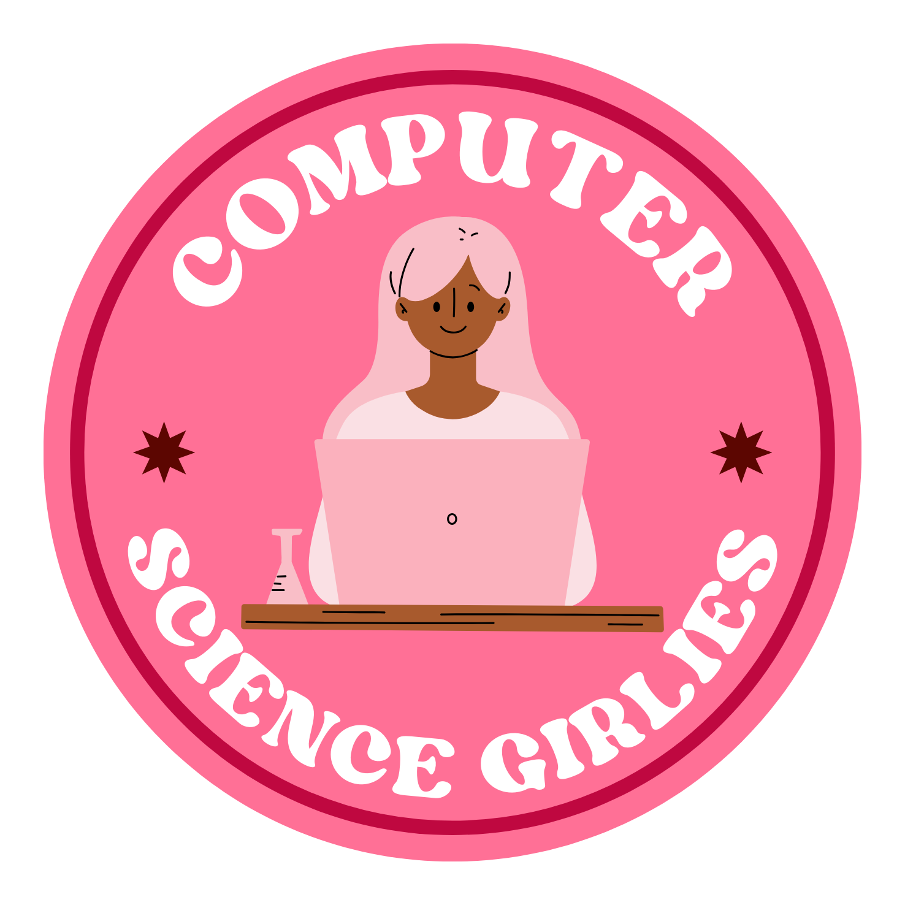

<div align="center">
    
    <h1>CS Girlies</h1>
    <p>The official website of the Computer Science Girlies community</p>
    <p>
        <a href="https://github.com/Computer-Science-Girlies/cs-girlies-com/stargazers">
            
        </a>
        <a href="https://github.com/Computer-Science-Girlies/cs-girlies-com/forks">
            
        </a>
        <a href="https://github.com/Computer-Science-Girlies/cs-girlies-com/graphs/contributors">
            
        </a>
        <a href="https://github.com/Computer-Science-Girlies/cs-girlies-com/blob/main/LICENSE">
            
        </a>
    </p>
</div>

## Setup

First, clone the repository:

```sh
git clone https://github.com/Computer-Science-Girlies/cs-girlies-com.git
cd cs-girlies-com
```

Install dependencies and start the dev server:

```sh
npm install
npm run dev
```

## Contributing

### Staff Members

1. create a new branch on GitHub or locally
2. make your changes
3. push your branch and open a pull request

```sh
git checkout -b [branch-name]
git add -A; git commit -am "Description of changes"
git push -u origin [branch-name]
```

### External Contributors

1. fork the repository on GitHub
2. clone your fork locally
3. make your changes and push them
4. open a pull request using "compare across forks"

```sh
git clone https://github.com/[your-username]/[name-of-fork].git
cd [name-of-fork]
git add -A; git commit -am "Description of changes"
git push origin main
```

After opening your pull request, add a clear title and description, then wait for a review.
